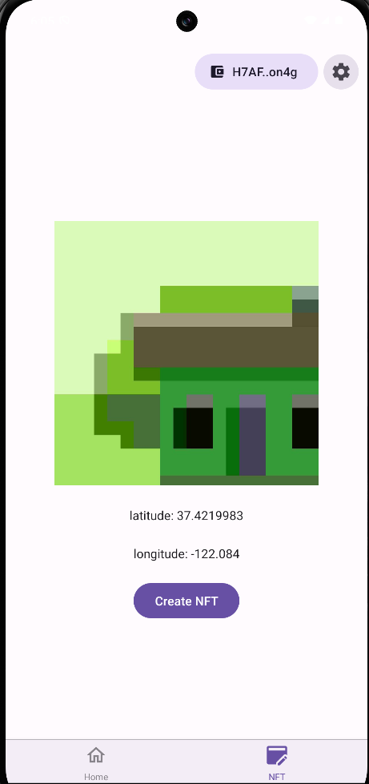

# Solana Mobile Camera NFT Minter

- Solana libraries: `web3.js`, Mobile Wallet Adapter, and `spl-token`.
- Required polyfills like `crypto` and `Buffer` configured.
- Pre-built React UI and re-usable hooks and code patterns like `useMobileWallet`.

**This is only fully functional on Android.**

<table>
  <tr>
    <td align="center">
      
    </td>
    <td align="center">
      
    </td>
    <td align="center">
      
    </td>
  </tr>
</table>


## Quick Start

### Prerequisites

- A free [Expo](https://expo.dev/) account.
- An Android device/emulator to test your app
  - Install an MWA compliant wallet app on your device/emulator.
- If using Expo's cloud service `eas build`, no further setup is required.
- If building locally:
  - React Native and Android Envrionment [setup](https://docs.solanamobile.com/getting-started/development-setup)

### Initialize

Run the CLI command:

```
yarn create expo-app --template @solana-mobile/solana-mobile-expo-template
```

Choose your project name then navigate into the directory.

### Build and run the app

Once your app is initialized, follow the **["Running the app"](https://docs.solanamobile.com/react-native/expo#running-the-app)** guide to launch the template as a custom development build.
